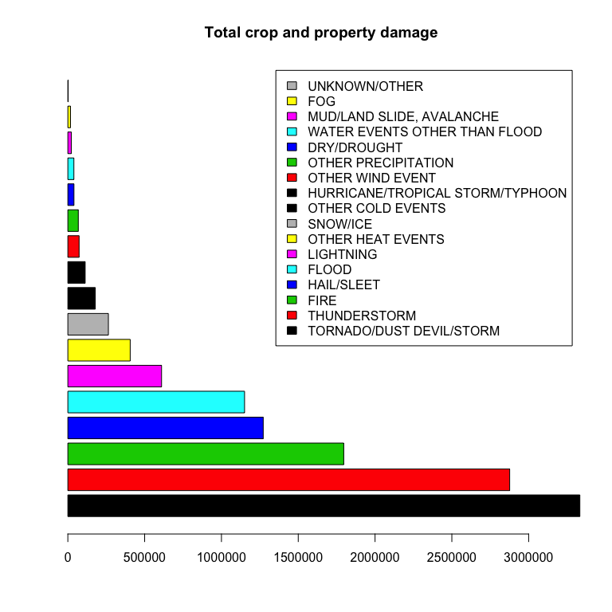

# US Storm Impact Report
July 27, 2014  

#Overview
This report investigates the following questions to support major storm event preparedness:  
** Across the United States, which types of events (as indicated in the EVTYPE variable) are most harmful with respect to population health?  
** Across the United States, which types of events have the greatest economic consequences?

Regional emergency managers can make best interpret this report within the context of their own region's particular risks. Additionally, long-range preparation that supports [community resilience][4] are beneficial across a broad spectrum of potential threats.
[4]: http://www.rand.org/topics/community-resilience.html "Community Resilience"

#Analysis Summary  
This analysis proceeds by downloading the data, then cleaning it up. In particular, the EVTYPE variable needed cleansing and standardizing. Then, metrics were run to summarize the fatalities, injuries, and economic damage caused by the different types of events.

#Context  
Storms and other severe weather events can cause both public health and economic problems for communities and municipalities. Many severe events can result in fatalities, injuries, and property damage, and preventing such outcomes to the extent possible is a key concern.

This project involves exploring the U.S. National Oceanic and Atmospheric Administration's (NOAA) storm database. This database tracks characteristics of major storms and weather events in the United States, including when and where they occur, as well as estimates of any fatalities, injuries, and property damage.

#Data Source

Data for this report are available, here: [Storm Data][1] [47Mb]  

There is also some documentation of the database available. Here, you will find how some of the variables are constructed/defined.  
* [National Weather Service Storm Data Documentation][2]  
* [National Climatic Data Center Storm Events FAQ][3]

[1]: https://d396qusza40orc.cloudfront.net/repdata%2Fdata%2FStormData.csv.bz2 "Storm Data"
[2]: https://d396qusza40orc.cloudfront.net/repdata%2Fpeer2_doc%2Fpd01016005curr.pdf "National Weather Service Storm Data Documentation"
[3]: https://d396qusza40orc.cloudfront.net/repdata%2Fpeer2_doc%2FNCDC%20Storm%20Events-FAQ%20Page.pdf "National Climatic Data Center Storm Events FAQ"

The events in the database start in the year 1950 and end in November 2011. In the earlier years of the database there are generally fewer events recorded, most likely due to a lack of good records. More recent years are considered more complete.

#Data Processing  
##Load the data  
Reading directly from bz2 zip file was required.  

```r
#setwd("/Users/yakich/vrygit/repro-research-assignment-2")

library(lattice)
library(gtools)

#download data
if(!file.exists("./data")){
    dir.create("./data")
}
fileUrl = "https://d396qusza40orc.cloudfront.net/repdata%2Fdata%2FStormData.csv.bz2"
zipfilepath = "./data/repdata-data-StormData.csv.bz2"
#unzipfilepath = "./data/repdata-data-StormData.csv"
if(!file.exists(zipfilepath)){
    download.file(fileUrl,destfile=zipfilepath,method="curl")
}

#unzipping failed, however discussion threads indicate I should read the bz2 directly
#if(!file.exists(unzipfilepath)){
#    unzip(zipfilepath,overwrite=TRUE, exdir="./data",unzip="internal")
#}

#load data into R, treat "testing set" as validation
storm.data.file = bzfile("./data/repdata-data-StormData.csv.bz2")
storm.data = read.csv(storm.data.file,
    #comment.char = "#",
    header = TRUE,
    sep = ",",
    colClasses = c("factor","character","character",
                   "character","factor","character","character",
                   "character",NA,"character","character",
                   "character","character",NA,NA,NA,"character","character",
                   NA,NA,NA,NA,NA,NA,NA,"character",NA,"character","character",
                   "character","character",NA,NA,NA,NA,"character",NA),
    as.is = TRUE,
    strip.white = TRUE,
    na.strings = c("\t","\t\t","#DIV/0",'""',"")
    )
```

##Explore Data  

```r
for(i in colnames(storm.data)){
    result = table(storm.data[,i])
    if(dim(result)[1] < 73){
        print(i)
        print(result)
    }
}
```

```
## [1] "STATE__"
## 
##  1.00 10.00 11.00 12.00 13.00 15.00 16.00 17.00 18.00 19.00  2.00 20.00 
## 22739  1913   450 22124 25259  2547  4767 28488 21506 31069  4390 53441 
## 21.00 22.00 23.00 24.00 25.00 26.00 27.00 28.00 29.00 30.00 31.00 32.00 
## 22092 17323  4524  8173  5651 17911 23609 22192 35648 14695 30271  3139 
## 33.00 34.00 35.00 36.00 37.00 38.00 39.00  4.00 40.00 41.00 42.00 44.00 
##  3022  8074  7130 21058 25351 14630 24923  6156 46802  4821 22226   839 
## 45.00 46.00 47.00 48.00 49.00  5.00 50.00 51.00 53.00 54.00 55.00 56.00 
## 17125 21728 21721 83728  4135 27102  3871 21189  3312  9099 19781  7332 
##  6.00 60.00 66.00 68.00 72.00 78.00  8.00 81.00 83.00 84.00 85.00 86.00 
## 10780   257   306     1  3016   338 20473   274     1    28  5337    96 
## 87.00 88.00 89.00  9.00 90.00 91.00 92.00 93.00 94.00 95.00 
##  1879  3250    23  3294   654  1347   262     9    70  1526 
## [1] "TIME_ZONE"
## 
##    ADT    AKS    AST    CDT    CSC    CSt    CST    EDT    ESt    EST 
##      3   1553   6360    692      1      4 547493    569      2 245558 
##    ESY    GMT    GST    HST    MDT    MST    PDT    PST    SCT    SST 
##      1      1     32   2563     99  68390    154  28302      2    505 
##    UNK    UTC 
##      9      4 
## [1] "STATE"
## 
##    AK    AL    AM    AN    AR    AS    AZ    CA    CO    CT    DC    DE 
##  4391 22739  1879  3250 27102   257  6156 10780 20473  3294   437  1913 
##    FL    GA    GM    GU    HI    IA    ID    IL    IN    KS    KY    LA 
## 22124 25259  5337   306  2547 31069  4767 28488 21506 53440 22092 17323 
##    LC    LE    LH    LM    LO    LS    MA    MD    ME    MH    MI    MN 
##   274  1526   654  1347    70   262  5652  8185  4524     1 17910 23609 
##    MO    MS    MT    NC    ND    NE    NH    NJ    NM    NV    NY    OH 
## 35648 22192 14695 25351 14632 30271  3022  8075  7129  3139 21058 24922 
##    OK    OR    PA    PH    PK    PM    PR    PZ    RI    SC    SD    SL 
## 46802  4821 22226    28    23     1  3015    96   839 17126 21727     7 
##    ST    TN    TX    UT    VA    VI    VT    WA    WI    WV    WY    XX 
##     1 21721 83728  4135 21189   338  3871  3312 19781  9099  7332     2 
## [1] "BGN_AZI"
## 
##     N    NW     E   Eas    EE   ENE   ESE   fee     M    mi   mil   Mil 
##     1     1 33178     1     1  8048  8009     1     2     1     2     1 
##     N    nd    Ne    NE   NNE   nnw   NNW    NW     S    Se    SE   SES 
## 86752     1     2 21107  8323     1  9027 24041 37558     1 21182     1 
##   SSE   SSW    sw    SW    th    to     W   Wes   WNW   WSW 
##  8401  8619     1 23840     4     6 38446     1  9457  8948 
## [1] "COUNTY_END"
## 
##      0 
## 902297 
## [1] "COUNTYENDN"
## < table of extent 0 >
## [1] "END_AZI"
## 
##     E   ENE   ESE   EST   Isl    mi   mil     N    NE    NN   NNE   NNW 
## 20047  4663  4156     1     1     1     1 28082 14606     2  4778  3915 
##    NW     S    SE    SS   SSE   SSW    SW    to     W   WNW   WSW 
## 13024 22510 13137     2  4114  3904 12935     1 20119  3881  3580 
## [1] "F"
## 
##     0     1     2     3     4     5 
## 24993 19475  9878  3179  1072   137 
## [1] "FATALITIES"
## 
##      0      1      2      3      4      5      6      7      8      9 
## 895323   5010    996    314    166    114     71     53     33     30 
##     10     11     12     13     14     15     16     17     18     19 
##     30     24     12     13     12      5     11      7      2      2 
##     20     21     22     23     24     25     26     27     29     30 
##      7      3      6      3      4      5      1      3      3      3 
##     31     32     33     34     36     37     38     42     44     46 
##      3      3      3      1      1      1      1      3      1      1 
##     49     50     57     67     74     75     90     99    114    116 
##      1      1      2      1      1      1      1      1      1      1 
##    158    583 
##      1      1 
## [1] "PROPDMGEXP"
## 
##      -      ?      +      0      1      2      3      4      5      6 
##      1      8      5    216     25     13      4      4     28      4 
##      7      8      B      h      H      K      m      M 
##      5      1     40      1      6 424665      7  11330 
## [1] "CROPDMGEXP"
## 
##      ?      0      2      B      k      K      m      M 
##      7     19      1      9     21 281832      1   1994
```
Notice that some values seem repeated in the table because of whitespace and different capitalization  

##Cleanse the data    
Data include whitespace and other slightly different spellings, so need to clean up the values, particularly for EVTYPE.

```r
#strip whitespace from character variables 
#  converting to upper case failed on multibyte character, not worth fixing
library(stringr)
for(i in colnames(storm.data)){
    if(class(storm.data[,i]) == "character"){
        storm.data[,i] = str_trim(storm.data[,i])
    }
}
#clean up EVTYPE
storm.data$EVTYPE = toupper(storm.data$EVTYPE)

storm.data$EVTYPE[grepl("SUMMARY",storm.data$EVTYPE)] = NA
storm.data$EVTYPE[grepl("OTHER",storm.data$EVTYPE)] = NA
storm.data$windevent = 
    grepl("WIND",storm.data$EVTYPE) |
    grepl("BLOW",storm.data$EVTYPE) |
    grepl("BURST",storm.data$EVTYPE)
storm.data$heatevent = 
    grepl("WARM",storm.data$EVTYPE) | 
    grepl("HEAT",storm.data$EVTYPE) |
    grepl("HOT",storm.data$EVTYPE) |
    grepl("HIGH",storm.data$EVTYPE) 
storm.data$coldevent = 
    grepl("COLD",storm.data$EVTYPE) | 
    grepl("FREEZ",storm.data$EVTYPE) | 
    grepl("COOL",storm.data$EVTYPE) | 
    grepl("WINTER",storm.data$EVTYPE) | 
    grepl("WINTRY",storm.data$EVTYPE) | 
    grepl("WINDCHILL",storm.data$EVTYPE) | 
    grepl("LOW TEMP",storm.data$EVTYPE) | 
    grepl("HYPOTHERMIA",storm.data$EVTYPE) 
storm.data$funnelevent = 
    grepl("TORNADO",storm.data$EVTYPE) | 
    grepl("FUNNEL",storm.data$EVTYPE) | 
    grepl("WATERSPOUT",storm.data$EVTYPE) | 
    grepl("DUST",storm.data$EVTYPE) |
    grepl("WALL CLOUD",storm.data$EVTYPE) 
storm.data$snowiceevent = 
    grepl("SNOW",storm.data$EVTYPE) | 
    grepl("BLIZZARD",storm.data$EVTYPE) | 
    grepl("ICE",storm.data$EVTYPE) | 
    grepl("ICY",storm.data$EVTYPE) | 
    grepl("GLAZE",storm.data$EVTYPE) | 
    grepl("FROST",storm.data$EVTYPE)  
storm.data$hailsleetevent = 
    grepl("HAIL",storm.data$EVTYPE) | 
    grepl("SLEET",storm.data$EVTYPE)  
storm.data$precipevent = 
    grepl("RAIN",storm.data$EVTYPE) | 
    grepl("SNOW",storm.data$EVTYPE) | 
    grepl("SHOWER",storm.data$EVTYPE) | 
    grepl("HAIL",storm.data$EVTYPE) | 
    grepl("SLEET",storm.data$EVTYPE) | 
    grepl("PRECIP",storm.data$EVTYPE) | 
    grepl("WET",storm.data$EVTYPE) | 
    grepl("HEAVY MIX",storm.data$EVTYPE)  
storm.data$floodevent = 
    grepl("FLD",storm.data$EVTYPE) | 
    grepl("FLOOD",storm.data$EVTYPE) | 
    grepl("FLOYD",storm.data$EVTYPE) | 
    grepl("STREAM",storm.data$EVTYPE) | 
    grepl("DAM BREAK",storm.data$EVTYPE)  
storm.data$thunderstormevent = 
    grepl("THUNDERSTORM",storm.data$EVTYPE) | 
    grepl("TSTM",storm.data$EVTYPE) 
storm.data$lightningevent =
    grepl("LIGHTNING",storm.data$EVTYPE)  
storm.data$dryevent =
    grepl("DROUGHT",storm.data$EVTYPE) |
    grepl("DRIEST",storm.data$EVTYPE) |
    grepl("DRY",storm.data$EVTYPE)
storm.data$fireevent =
    grepl("FIRE",storm.data$EVTYPE) |
    grepl("SMOKE",storm.data$EVTYPE) |
    grepl("ASH",storm.data$EVTYPE) |
    grepl("FIRE",storm.data$EVTYPE) 
storm.data$fogevent =
    grepl("FOG",storm.data$EVTYPE) 
storm.data$lightningevent =
    grepl("LIGHT",storm.data$EVTYPE) 
storm.data$hurricaneevent = 
    grepl("HURRICANE",storm.data$EVTYPE) |
    grepl("TROPICAL STORM",storm.data$EVTYPE) |
    grepl("COASTAL",storm.data$EVTYPE) |
    grepl("TYPHOON",storm.data$EVTYPE) |
    grepl("GUSTNADO",storm.data$EVTYPE) 
storm.data$slideevent =
    grepl("SLIDE",storm.data$EVTYPE) |
    grepl("AVALAN",storm.data$EVTYPE) |
    grepl("LANDSLUMP",storm.data$EVTYPE)
storm.data$waterevent =
    grepl("CURRENT",storm.data$EVTYPE) |
    grepl("STORM SURGE",storm.data$EVTYPE) |
    grepl("SURF",storm.data$EVTYPE) |
    grepl("TIDE",storm.data$EVTYPE) |
    grepl("TSUNAMI",storm.data$EVTYPE) |
    grepl("SEICHE",storm.data$EVTYPE) |
    grepl("SWELL",storm.data$EVTYPE) |
    grepl("WAVE",storm.data$EVTYPE) |
    grepl("HEAVY SEAS",storm.data$EVTYPE) |
    grepl("ROUGH SEAS",storm.data$EVTYPE) |
    grepl("HIGH SEAS",storm.data$EVTYPE) |
    grepl("HIGH WATER",storm.data$EVTYPE) 

#in increasing order of importance
storm.data$event = NA
storm.data$event[is.na(storm.data$event)] = "UNKNOWN/OTHER"
storm.data$event[storm.data$windevent] = "OTHER WIND EVENT"
storm.data$event[storm.data$precipevent] = "OTHER PRECIPITATION"
storm.data$event[storm.data$coldevent] = "OTHER COLD EVENTS"
storm.data$event[storm.data$heatevent] = "OTHER HEAT EVENTS"
storm.data$event[storm.data$snowiceevent] = "SNOW/ICE"
storm.data$event[storm.data$hailsleetevent] = "HAIL/SLEET"
storm.data$event[storm.data$fogevent] = "FOG"
storm.data$event[storm.data$lightningevent] = "LIGHTNING"
storm.data$event[storm.data$dryevent] = "DRY/DROUGHT"
storm.data$event[storm.data$waterevent] = "WATER EVENTS OTHER THAN FLOOD"
storm.data$event[storm.data$slideevent] = "MUD/LAND SLIDE, AVALANCHE"
storm.data$event[storm.data$thunderstormevent] = "THUNDERSTORM"
storm.data$event[storm.data$floodevent] = "FLOOD"
storm.data$event[storm.data$funnelevent] = "TORNADO/DUST DEVIL/STORM"
storm.data$event[storm.data$hurricaneevent] = "HURRICANE/TROPICAL STORM/TYPHOON"
storm.data$event[storm.data$fireevent] = "FIRE"
#fill in the remaining to roll those up similarly to the key categories above
```

#Population Health Impacts
##Fatlities by event category

```r
eventtypes = unique(storm.data$event)
eventcounts = sapply(eventtypes,
       function(x) sum(storm.data$FATALITIES[storm.data$event == x],na.rm=TRUE))
sort(eventcounts,decreasing = TRUE)
```

```
##         TORNADO/DUST DEVIL/STORM                OTHER HEAT EVENTS 
##                             5688                             3258 
##                             FIRE    WATER EVENTS OTHER THAN FLOOD 
##                             1125                             1000 
##                        LIGHTNING                OTHER COLD EVENTS 
##                              818                              745 
##                     THUNDERSTORM                            FLOOD 
##                              729                              512 
##                         SNOW/ICE        MUD/LAND SLIDE, AVALANCHE 
##                              379                              269 
## HURRICANE/TROPICAL STORM/TYPHOON                 OTHER WIND EVENT 
##                              211                              157 
##              OTHER PRECIPITATION                              FOG 
##                              103                               81 
##                      DRY/DROUGHT                    UNKNOWN/OTHER 
##                               34                               19 
##                       HAIL/SLEET 
##                               17
```

##Injuries by event category

```r
eventtypes = unique(storm.data$event)
eventcounts = sapply(eventtypes,
       function(x) sum(storm.data$INJURIES[storm.data$event == x],na.rm=TRUE))
sort(eventcounts,decreasing = TRUE)
```

```
##         TORNADO/DUST DEVIL/STORM                OTHER HEAT EVENTS 
##                            91922                            10330 
##                     THUNDERSTORM                            FLOOD 
##                             9544                             6874 
##                        LIGHTNING                         SNOW/ICE 
##                             5233                             4370 
##                             FIRE                OTHER COLD EVENTS 
##                             3410                             2311 
## HURRICANE/TROPICAL STORM/TYPHOON                       HAIL/SLEET 
##                             1725                             1371 
##    WATER EVENTS OTHER THAN FLOOD                              FOG 
##                             1356                             1077 
##                 OTHER WIND EVENT              OTHER PRECIPITATION 
##                              429                              306 
##        MUD/LAND SLIDE, AVALANCHE                      DRY/DROUGHT 
##                              226                               33 
##                    UNKNOWN/OTHER 
##                               11
```

#Economic Impacts 
Total Crop and Property damage

```r
eventtypes = unique(storm.data$event)
eventcounts = sapply(eventtypes,
       function(x){
            sum(storm.data$PROPDMG[storm.data$event == x],na.rm=TRUE) +
            sum(storm.data$CROPDMG[storm.data$event == x],na.rm=TRUE)})
eventcounts = sort(eventcounts,decreasing = TRUE)
str(eventcounts)
```

```
##  Named num [1:17] 3333483 2876576 1796247 1272002 1150482 ...
##  - attr(*, "names")= chr [1:17] "TORNADO/DUST DEVIL/STORM" "THUNDERSTORM" "FIRE" "HAIL/SLEET" ...
```

```r
barplot(eventcounts,col = c(1,2,3,4,5,6,7,8,9),horiz = TRUE,beside=TRUE,main="Total crop and property damage",legend=names(eventcounts),axisnames=FALSE)
```

 

#Results
Tornados (along with dust devils & dust storms) cause the most fatalities. Heat, fire, flood, and lightning follow behind.
Tornados (along with dust devils & dust storms) cause the most injuries. Heat, thunderstorms, flood, and lightning follow behind.
Tornados (along with dust devils & dust storms) cause the most property damage. Heat, thunderstorm, flood, and lightning follow behind.

Further analysis should tease out the distinction between tornados, dust devils, and dust storms.
